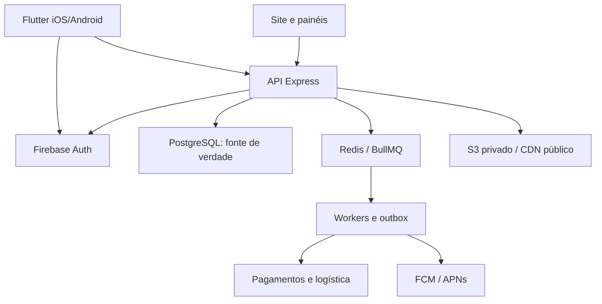
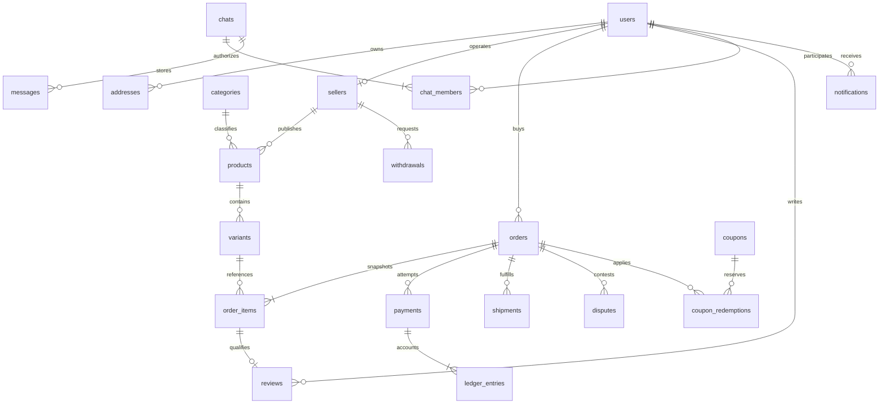

# Arquitetura e modelo de dados

## Escolhas

Flutter gera aplicativos nativos a partir de uma base. Viewer WebGL no detalhe é integração web dentro do app, não garantia de melhor desempenho 3D que React Native. Express/Node24 mantém compatibilidade com o projeto existente. PostgreSQL é autoridade de preços, estoque, pedidos e contabilidade. Firebase Auth verifica identidade; roles/ownership continuam no banco. Redis/BullMQ, Socket.IO, S3/CloudFront e FCM são componentes de destino, ainda não implementados nesta base.

Evitar migrar o site para Firebase automaticamente: ele tem outra autenticação e dados. Conectar as contas exige reautenticação dos dois lados e tabela explícita de identidades. Usar um único armazenamento durável de mensagens (PostgreSQL + Socket.IO nesta proposta), evitando duplo write com Firestore. Se Firestore for adotado, substituir esse componente com regras de acesso, retenção e reconciliação testadas.

## ER de destino

O diagrama é o **modelo final proposto**, não uma afirmação de tabelas já migradas. A implementação efetiva está em `services/marketplace-api/migrations`. O schema é isolado para não alterar a base do site sem reconciliação.

| Entidade | Campos e invariantes essenciais |
| --- | --- |
| users/identities | UUID interno, provedor+subject único, e-mail verificado, role, disabled, consent_version; nunca elevar por payload |
| sellers | user_id único, KYC/status, identidade fiscal privada, gateway_account_id, comissão versionada |
| products/categories | vendedor, slug único, categoria, tipo físico/digital/serviço, status draft/review/active/paused; mídia verificada |
| variants | SKU único, cor/material/tamanho, preço em inteiro, stock/reserved não negativos, version para edição concorrente |
| addresses | user_id, CEP/UF/país e dados completos; snapshot no pedido, não FK como endereço histórico mutável |
| carts/cart_items | usuário/variante únicos, quantidade positiva limitada, revision; preço recalculado no checkout |
| orders | buyer_id, estado, moeda BRL, centavos, snapshot de endereço, chave idempotente por comprador, expires_at |
| order_items | vendedor/variante, nome/preço/custo/quantidade/prazo/licença em snapshot |
| payments | order_id, provider_id único, idempotency_key única, collector, live_mode, amount, status e refund_amount |
| webhook_inbox/outbox | provider+event_id únicos; payload minimizado e assinatura validada; retries, processed_at |
| shipments | seller/order, quote_id, preço/prazo contratual, etiqueta e tracking, eventos normalizados |
| reviews/media | order_item único, autor do pedido entregue, stars 1..5, moderation_status; arquivos em quarentena |
| chats/members/messages | membros por conversa únicos, cliente/vendedor do pedido, client_message_id único por emissor, sequência |
| coupons/redemptions | validade, escopo vendedor, uso máximo, limite por usuário, reserva vinculada ao pedido e reversão |
| ledger_entries | evento idempotente, débito/crédito balanceados, centavos, moeda; sem edição destrutiva |
| withdrawals | seller, available_balance, estado, gateway_ref; reserva financeira impede saque duplo |
| notifications/devices | usuário, finalidade/canal, unread, push_token protegido, plataforma e opt-in |
| audit_events | ator/role, ação, recurso, request_id, mudanças mínimas; sem senha/token/STL/documento completo |

## Pagamento e concorrência

1. Abrir transação; travar carrinho e variantes em ordem determinística. Validar vendedor ativo, estoque, cupom/frete e snapshot. Total em centavos usando valores do banco. Reservar estoque com validade e salvar order/idempotency/outbox juntos.
2. Worker cria intenção no gateway com chave persistida. Timeout deixa estado `payment_pending`, nunca cria intenção com nova chave para o mesmo pedido.
3. Webhook: validar HMAC/timestamp e inserir inbox única antes de ACK. Eventos reentregues são aceitos sem novo efeito. Worker consulta o gateway pelo ID armazenado.
4. Comparar payment_id, external_reference, collector_id, moeda, valor e live_mode com dados persistidos. Somente resposta autoritativa aprovada libera produção. Nunca aceitar sucesso enviado pelo app.
5. Uma transação trava pedido/pagamento, escreve transição, ledger, baixa reserva, coupon redemption e outbox. Publicar push/socket apenas depois do commit.
6. Conciliador periódico recupera timeouts/eventos perdidos. Pagamento tardio depois da expiração exige nova avaliação de estoque ou estorno; não produz silenciosamente.
7. Refund/chargeback corrigem ledger/cashback e bloqueiam saldo sacável correspondente. Estorno por vendedor preserva proporcionalidade do split e tarifas contratuais.

Mercado Pago possui produtos diferentes para Pix e split 1:N; disponibilidade contratual e API precisam ser homologadas, não presumidas pela existência de um token. A classe Pix nesta base não implementa esse ciclo inteiro.

## Segurança e arquivos

Bearer Firebase verificado no backend com revogação; claims não substituem role no banco. Recurso privado exige ownership em toda query. Administrador usa MFA, sessões auditadas e operações críticas com motivo. Rate limit distribuído e proteção de borda são necessários antes de múltiplas réplicas; limiter em memória não é limite global.

Uploads: URL pré-assinada curta, tipo/tamanho e hash, chave gerada pelo servidor, bucket privado, quarentena/scan, processamento STL em worker isolado sem acesso à rede, thumbnail aprovado publicado em CDN. Proteger modelos contra zip bombs, paths e parsers maliciosos. Download de STL digital exige pedido pago e licença, com URL expirá­vel.

Dados pessoais: criptografia do provedor em repouso com chaves geridas, TLS em trânsito, backups criptografados, retenção por finalidade, exportação e exclusão com obrigação fiscal preservada. Nenhum token em logs. A conformidade depende também de processos e contratos reais.

## Eventos, offline e escalabilidade

Eventos possuem id, tipo, agregado, versão e timestamp. Socket room somente após consulta de autorização; reconectar consulta estados perdidos por cursor. Typing é efêmero com TTL e rate limit. Push transporta ID e mensagem mínima, nunca STL ou documento.

Offline permite ver cache identificado como desatualizado e editar carrinho local. Confirmar compra, cotação/frete ou pagamento exige rede. Outbox local deve usar IDs duráveis, estado retry, namespace usuário+origem e confirmação por versão; logout limpa memória e não envia ações de outro usuário.

Paginação keyset/índices, consultas limitadas, CDN para mídia, pool de conexões e workers com backpressure. Recomendações e embeddings ficam fora do caminho síncrono de compra. Teste de carga mede concorrência, p95/p99, erros, locks, filas e saturação do banco; só o resultado permite publicar capacidade.
